# 🛒 Admin Order Management Flow - Complete Guide

## 📋 Table of Contents
1. [Overview](#overview)
2. [Order Flow Diagram](#order-flow-diagram)
3. [Step-by-Step Admin Process](#step-by-step-admin-process)
4. [Customer Management](#customer-management)
5. [Product Selection & Quality Control](#product-selection--quality-control)
6. [Inventory Integration](#inventory-integration)
7. [Production Triggers](#production-triggers)
8. [Payment Processing](#payment-processing)
9. [Order Status Management](#order-status-management)
10. [Quality-Based Selection](#quality-based-selection)

---

## 🎯 Overview

The Admin Order Management Flow is a comprehensive system that allows administrators to handle customer orders efficiently while maintaining quality control, inventory accuracy, and production integration. This system supports both existing and new customers, handles product availability scenarios, and ensures proper stock allocation.

### Key Features:
- **👤 Customer Management**: Existing customer auto-fill and new customer registration
- **🎯 Quality-Based Selection**: FIFO with quality grade consideration
- **📦 Inventory Integration**: Real-time stock checking and allocation
- **🏭 Production Triggers**: Automatic production requests for unavailable products
- **💰 Flexible Pricing**: Manual pricing with GST and discount options
- **📊 Order Tracking**: Complete order lifecycle management

---

## 🔄 Order Flow Diagram

```mermaid
graph TD
    A[👤 Customer Selection] --> B{🔍 Existing Customer?}
    B -->|✅ Yes| C[📋 Auto-fill Customer Details]
    B -->|❌ No| D[➕ New Customer Registration]
    
    C --> E[🛍️ Product Selection]
    D --> E
    
    E --> F{📦 Product Available?}
    F -->|✅ Yes| G[🎯 Quality-Based Selection]
    F -->|❌ No| H{🆕 New Product?}
    
    G --> I[💰 Price Calculation]
    H -->|✅ Yes| J[🏭 Create Product + Production]
    H -->|❌ No| K[🏭 Production Request]
    
    J --> L[⏳ Wait for Production]
    K --> L
    L --> M[📦 Product Ready]
    M --> G
    
    I --> N[💳 Payment Processing]
    N --> O[✅ Order Confirmation]
    O --> P[📦 Stock Allocation]
    P --> Q[📊 Update Inventory]
    
    style A fill:#e1f5fe
    style G fill:#e8f5e8
    style J fill:#fff3e0
    style K fill:#fff3e0
    style O fill:#e8f5e8
```



---

## 📋 Step-by-Step Admin Process

### **Phase 1: Customer Management**

#### **Step 1: Customer Selection**
```typescript
interface CustomerSelection {
  type: "existing" | "new";
  customerId?: string;
  searchTerm?: string;
  autoFill?: boolean;
}
```

**Process:**
1. **Search Existing Customers**
   - Search by name, phone, email, or customer ID
   - Auto-complete suggestions
   - Customer history preview

2. **Auto-fill Customer Details**
   - Name, address, contact information
   - Previous order history
   - Payment preferences
   - Credit limit and terms

3. **New Customer Registration**
   - Required fields: Name, Phone, Email
   - Optional: Address, Company, Tax ID
   - Auto-generate customer ID
   - Set credit terms

#### **Step 2: Customer Validation**
```typescript
interface CustomerValidation {
  creditLimit: number;
  outstandingAmount: number;
  paymentHistory: PaymentRecord[];
  orderHistory: OrderRecord[];
  status: "active" | "suspended" | "new";
}
```

---

### **Phase 2: Product Selection & Quality Control**

#### **Step 3: Product Search & Selection**
```typescript
interface ProductSelection {
  searchTerm: string;
  category: string;
  color: string;
  size: string;
  qualityGrade: "A+" | "A" | "B" | "C";
  availability: "in-stock" | "low-stock" | "out-of-stock";
}
```

**Process:**
1. **Product Search**
   - Search by name, category, color, size
   - Filter by quality grade
   - Real-time availability check

2. **Quality-Based Display**
   - Show available quantities by quality grade
   - Individual product details
   - Manufacturing date and batch information

#### **Step 4: Individual Product Selection**
```typescript
interface IndividualProductSelection {
  productId: string;
  individualProducts: IndividualProduct[];
  selectionCriteria: {
    qualityGrade: string;
    manufacturingDate: string;
    batchNumber: string;
    maxAge?: number; // For FIFO
  };
}
```

**Quality-Based Selection Process:**
1. **FIFO with Quality Priority**
   - Show oldest products first (FIFO)
   - Highlight quality grades (A+ > A > B > C)
   - Display individual product details

2. **Selection Interface**
   - Grid/list view of individual products
   - Quality grade badges
   - Manufacturing date and batch info
   - Individual product specifications

3. **Selection Confirmation**
   - Show selected products summary
   - Quality grade distribution
   - Total value calculation
   - Allow modification before confirmation

---

### **Phase 3: Inventory Integration**

#### **Step 5: Stock Availability Check**
```typescript
interface StockCheck {
  requiredQuantity: number;
  availableQuantity: number;
  qualityBreakdown: {
    "A+": number;
    "A": number;
    "B": number;
    "C": number;
  };
  individualProducts: IndividualProduct[];
}
```

**Process:**
1. **Real-time Stock Check**
   - Check available quantity
   - Quality grade breakdown
   - Individual product details

2. **Availability Scenarios**
   - **Fully Available**: All quantity in stock
   - **Partially Available**: Some quantity available
   - **Not Available**: No stock available
   - **New Product**: Product doesn't exist

#### **Step 6: Stock Allocation Strategy**
```typescript
interface StockAllocation {
  strategy: "fifo" | "quality-first" | "manual";
  selectedProducts: IndividualProduct[];
  allocationReason: string;
  qualityDistribution: QualityBreakdown;
}
```

**Allocation Strategies:**
1. **FIFO (First In, First Out)**
   - Select oldest products first
   - Maintain quality standards
   - Prevent product aging

2. **Quality-First**
   - Prioritize higher quality grades
   - Customer preference consideration
   - Premium pricing justification

3. **Manual Selection**
   - Admin selects specific products
   - Customer requirements consideration
   - Special handling instructions

---

### **Phase 4: Production Integration**

#### **Step 7: Production Triggers**
```typescript
interface ProductionTrigger {
  triggerType: "insufficient-stock" | "new-product" | "custom-requirement";
  productDetails: ProductSpecification;
  requiredQuantity: number;
  priority: "normal" | "high" | "urgent";
  customerRequirements: CustomerSpecification;
}
```

**Production Scenarios:**

1. **Insufficient Stock**
   ```typescript
   // Product exists but not enough quantity
   if (availableQuantity < requiredQuantity) {
     const productionRequest = {
       productId: existingProduct.id,
       requiredQuantity: requiredQuantity - availableQuantity,
       priority: orderPriority,
       customerId: customer.id,
       orderId: order.id
     };
     triggerProduction(productionRequest);
   }
   ```

2. **New Product**
   ```typescript
   // Product doesn't exist in inventory
   if (!productExists) {
     const newProductRequest = {
       productName: customerSpecification.name,
       specifications: customerSpecification,
       requiredQuantity: requiredQuantity,
       priority: orderPriority,
       customerId: customer.id,
       orderId: order.id
     };
     createProductAndTriggerProduction(newProductRequest);
   }
   ```

#### **Step 8: Order Status Management**
```typescript
interface OrderStatus {
  status: "pending" | "confirmed" | "in-production" | "ready-to-ship" | "completed";
  productionStatus?: ProductionStatus;
  inventoryStatus?: InventoryStatus;
  paymentStatus?: PaymentStatus;
}
```

**Status Flow:**
1. **Pending**: Order created, awaiting confirmation
2. **Confirmed**: Order confirmed, stock allocated or production triggered
3. **In Production**: Products being manufactured
4. **Ready to Ship**: Products available, ready for delivery
5. **Completed**: Order fulfilled and delivered

---

### **Phase 5: Pricing & Payment**

#### **Step 9: Price Calculation**
```typescript
interface PriceCalculation {
  basePrice: number;
  qualityMultiplier: number;
  quantityDiscount: number;
  gstRate: number;
  gstAmount: number;
  discountAmount: number;
  finalAmount: number;
}
```

**Pricing Components:**
1. **Base Price**: Standard product price
2. **Quality Multiplier**: Price adjustment based on quality grade
3. **Quantity Discount**: Bulk purchase discounts
4. **GST Calculation**: Tax calculation
5. **Manual Adjustments**: Admin override capabilities

#### **Step 10: Payment Processing**
```typescript
interface PaymentProcessing {
  totalAmount: number;
  amountPaid: number;
  outstandingAmount: number;
  paymentMethod: "cash" | "card" | "bank-transfer" | "credit";
  paymentTerms: string;
  dueDate: string;
}
```

**Payment Options:**
1. **Full Payment**: Complete payment at order time
2. **Partial Payment**: Partial payment with outstanding balance
3. **Credit Terms**: Payment on credit with due date
4. **Installment**: Multiple payment installments

---

## 🎯 Quality-Based Selection

### **Quality Grade System**
```typescript
interface QualityGrade {
  grade: "A+" | "A" | "B" | "C";
  description: string;
  priceMultiplier: number;
  selectionPriority: number;
  customerPreference: number;
}
```

**Quality Grades:**
- **A+ (Excellent)**: Premium quality, highest price
- **A (Very Good)**: High quality, standard premium
- **B (Good)**: Standard quality, regular price
- **C (Acceptable)**: Basic quality, discounted price

### **Selection Algorithm**
```typescript
function selectProductsByQuality(
  requiredQuantity: number,
  availableProducts: IndividualProduct[],
  customerPreference: QualityGrade
): IndividualProduct[] {
  // 1. Sort by manufacturing date (FIFO)
  const sortedByDate = availableProducts.sort((a, b) => 
    new Date(a.manufacturingDate).getTime() - new Date(b.manufacturingDate).getTime()
  );
  
  // 2. Filter by customer preference
  const preferredQuality = sortedByDate.filter(p => 
    p.qualityGrade === customerPreference.grade
  );
  
  // 3. If preferred quality not available, fall back to higher quality
  if (preferredQuality.length < requiredQuantity) {
    const higherQuality = sortedByDate.filter(p => 
      getQualityPriority(p.qualityGrade) >= getQualityPriority(customerPreference.grade)
    );
    return higherQuality.slice(0, requiredQuantity);
  }
  
  return preferredQuality.slice(0, requiredQuantity);
}
```

---

## 🔄 Integration Points

### **Inventory Integration**
- Real-time stock checking
- Individual product selection
- Quality-based allocation
- Stock status updates

### **Production Integration**
- Automatic production triggers
- Production status tracking
- Product completion notifications
- Inventory updates

### **Customer Integration**
- Customer history tracking
- Credit limit management
- Payment history
- Order history

### **Payment Integration**
- Multiple payment methods
- Credit term management
- Outstanding balance tracking
- Payment reminders

---

## 📊 Admin Interface Features

### **Customer Management**
- Customer search and selection
- Auto-fill customer details
- New customer registration
- Customer history view

### **Product Selection**
- Product search and filtering
- Quality-based product display
- Individual product selection
- Selection confirmation

### **Order Management**
- Order creation and editing
- Status tracking
- Production integration
- Payment processing

### **Quality Control**
- Quality grade display
- Individual product details
- Selection criteria
- Quality distribution

---

## 🚀 Best Practices

### **Customer Management**
- ✅ Always verify customer details
- ✅ Check credit limits before order
- ✅ Maintain customer history
- ❌ Don't skip customer validation

### **Product Selection**
- ✅ Use FIFO for stock rotation
- ✅ Consider quality preferences
- ✅ Verify product specifications
- ❌ Don't ignore quality grades

### **Production Integration**
- ✅ Set realistic production timelines
- ✅ Communicate with customers
- ✅ Track production progress
- ❌ Don't overpromise delivery dates

### **Payment Processing**
- ✅ Verify payment amounts
- ✅ Set clear payment terms
- ✅ Track outstanding balances
- ❌ Don't skip payment validation

---

*This comprehensive admin order flow ensures efficient order processing while maintaining quality control and customer satisfaction.*
