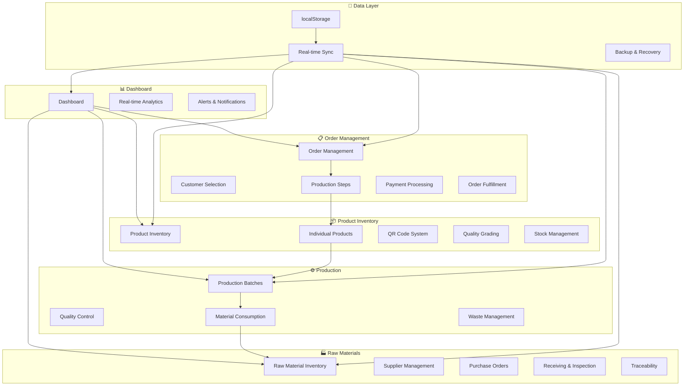
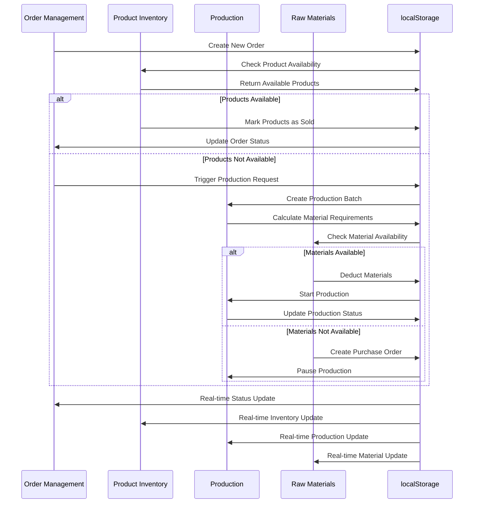

# 🏭 Rajdhani Carpet ERP - Complete System Integration

## 🎯 System Overview

The Rajdhani Carpet ERP is a comprehensive, real-time integrated system that manages the entire carpet manufacturing workflow from raw materials to customer delivery. All modules are interconnected with localStorage-based real-time data synchronization.

## 🔗 Complete System Architecture



## 🔄 Real-Time Data Flow

### 1. Order Management → Product Inventory → Production → Raw Materials



## 📊 localStorage Data Structure

### Core Data Objects

```typescript
// Main localStorage Keys
const STORAGE_KEYS = {
  ORDERS: 'rajdhani_orders',
  PRODUCTS: 'rajdhani_products',
  INDIVIDUAL_PRODUCTS: 'rajdhani_individual_products',
  PRODUCTION_BATCHES: 'rajdhani_production_batches',
  RAW_MATERIALS: 'rajdhani_raw_materials',
  CUSTOMERS: 'rajdhani_customers',
  MATERIAL_CONSUMPTION: 'rajdhani_material_consumption',
  SYSTEM_SETTINGS: 'rajdhani_settings',
  AUDIT_LOG: 'rajdhani_audit_log'
};

// Real-time Data Interfaces
interface SystemData {
  orders: Order[];
  products: Product[];
  individualProducts: IndividualProduct[];
  productionBatches: ProductionBatch[];
  rawMaterials: RawMaterial[];
  customers: Customer[];
  materialConsumption: MaterialConsumption[];
  lastSync: string;
  version: string;
}

// Audit Log for Complete Traceability
interface AuditLog {
  id: string;
  timestamp: string;
  action: string;
  module: 'orders' | 'products' | 'production' | 'materials';
  userId: string;
  details: any;
  previousState?: any;
  newState?: any;
}
```

## 🔗 Module Integration Details

### 1. Order Management Integration

#### Order Creation Flow
```typescript
// Order Creation with Real-time Integration
const createOrder = (orderData: OrderData) => {
  const order: Order = {
    id: generateUniqueId('ORD'),
    customerId: orderData.customerId,
    products: orderData.products,
    totalAmount: calculateTotal(orderData.products),
    status: 'pending',
    createdAt: new Date().toISOString(),
    updatedAt: new Date().toISOString()
  };

  // Save to localStorage
  saveToStorage(STORAGE_KEYS.ORDERS, order);
  
  // Real-time inventory check
  const inventoryStatus = checkInventoryAvailability(order.products);
  
  if (inventoryStatus.allAvailable) {
    // Mark products as sold
    updateProductStatus(order.products, 'sold');
    order.status = 'confirmed';
  } else {
    // Trigger production for unavailable products
    triggerProduction(order.products.filter(p => !p.available));
    order.status = 'production_required';
  }
  
  // Update localStorage
  updateStorage(STORAGE_KEYS.ORDERS, order);
  
  // Log audit trail
  logAudit('order_created', 'orders', order);
  
  return order;
};
```

#### Product Selection with Quality Control
```typescript
// Quality-based Product Selection
const selectProductsForOrder = (requirements: ProductRequirements) => {
  const availableProducts = getFromStorage(STORAGE_KEYS.INDIVIDUAL_PRODUCTS)
    .filter(p => p.status === 'available')
    .filter(p => p.qualityGrade >= requirements.minQuality)
    .sort((a, b) => new Date(a.manufacturingDate).getTime() - new Date(b.manufacturingDate).getTime()); // FIFO

  const selectedProducts = availableProducts.slice(0, requirements.quantity);
  
  // Real-time update
  selectedProducts.forEach(product => {
    product.status = 'reserved';
    product.reservedForOrder = requirements.orderId;
  });
  
  updateStorage(STORAGE_KEYS.INDIVIDUAL_PRODUCTS, selectedProducts);
  
  return selectedProducts;
};
```

### 2. Product Inventory Integration

#### Individual Product Management
```typescript
// Individual Product Creation from Production
const createIndividualProducts = (productionBatch: ProductionBatch) => {
  const products: IndividualProduct[] = [];
  
  for (let i = 0; i < productionBatch.quantity; i++) {
    const product: IndividualProduct = {
      id: generateUniqueId('PROD'),
      qrCode: generateQRCode(productionBatch.id, i),
      productId: productionBatch.productId,
      manufacturingDate: new Date().toISOString(),
      materialsUsed: productionBatch.materialsUsed,
      qualityGrade: 'pending',
      status: 'in_production',
      batchNumber: productionBatch.id,
      productionStep: 'completed'
    };
    
    products.push(product);
  }
  
  // Save to localStorage
  saveToStorage(STORAGE_KEYS.INDIVIDUAL_PRODUCTS, products);
  
  // Update production batch
  productionBatch.individualProducts = products.map(p => p.id);
  updateStorage(STORAGE_KEYS.PRODUCTION_BATCHES, productionBatch);
  
  return products;
};
```

#### Quality Inspection Integration
```typescript
// Quality Inspection with Real-time Updates
const performQualityInspection = (productId: string, inspection: QualityInspection) => {
  const product = getFromStorage(STORAGE_KEYS.INDIVIDUAL_PRODUCTS)
    .find(p => p.id === productId);
  
  if (product) {
    product.qualityGrade = inspection.grade;
    product.inspector = inspection.inspector;
    product.inspectionDate = new Date().toISOString();
    product.status = inspection.grade === 'rejected' ? 'damaged' : 'available';
    product.notes = inspection.notes;
    
    // Update localStorage
    updateStorage(STORAGE_KEYS.INDIVIDUAL_PRODUCTS, product);
    
    // Update main product inventory
    updateMainProductInventory(product.productId);
    
    // Log audit trail
    logAudit('quality_inspection', 'products', { productId, inspection });
  }
};
```

### 3. Production Integration

#### Production Batch Creation
```typescript
// Production Batch with Material Requirements
const createProductionBatch = (batchData: ProductionBatchData) => {
  const batch: ProductionBatch = {
    id: generateUniqueId('BATCH'),
    productId: batchData.productId,
    quantity: batchData.quantity,
    status: 'planning',
    materialsRequired: calculateMaterialRequirements(batchData),
    steps: batchData.steps,
    createdAt: new Date().toISOString(),
    expectedCompletion: calculateExpectedCompletion(batchData)
  };
  
  // Check material availability
  const materialStatus = checkMaterialAvailability(batch.materialsRequired);
  
  if (materialStatus.allAvailable) {
    batch.status = 'ready_to_start';
    // Reserve materials
    reserveMaterials(batch.materialsRequired, batch.id);
  } else {
    batch.status = 'waiting_for_materials';
    // Create purchase orders for missing materials
    createPurchaseOrders(materialStatus.missingMaterials);
  }
  
  // Save to localStorage
  saveToStorage(STORAGE_KEYS.PRODUCTION_BATCHES, batch);
  
  return batch;
};
```

#### Material Consumption Tracking
```typescript
// Real-time Material Consumption
const recordMaterialConsumption = (batchId: string, stepId: number, consumption: MaterialConsumptionData) => {
  const consumptionRecord: MaterialConsumption = {
    id: generateUniqueId('CONS'),
    productionBatchId: batchId,
    stepId: stepId,
    stepName: consumption.stepName,
    consumedQuantity: consumption.quantity,
    wasteQuantity: consumption.waste || 0,
    consumptionDate: new Date().toISOString(),
    operator: consumption.operator,
    materials: consumption.materials
  };
  
  // Save consumption record
  saveToStorage(STORAGE_KEYS.MATERIAL_CONSUMPTION, consumptionRecord);
  
  // Update raw material inventory
  consumption.materials.forEach(material => {
    updateRawMaterialStock(material.materialId, -material.quantity);
  });
  
  // Update production batch progress
  updateProductionProgress(batchId, stepId);
  
  // Log audit trail
  logAudit('material_consumption', 'production', consumptionRecord);
};
```

### 4. Raw Materials Integration

#### Real-time Stock Management
```typescript
// Real-time Stock Updates
const updateRawMaterialStock = (materialId: string, quantityChange: number) => {
  const materials = getFromStorage(STORAGE_KEYS.RAW_MATERIALS);
  const material = materials.find(m => m.id === materialId);
  
  if (material) {
    const previousStock = material.currentStock;
    material.currentStock += quantityChange;
    material.lastUpdated = new Date().toISOString();
    
    // Update status based on stock levels
    if (material.currentStock <= material.minThreshold) {
      material.status = 'low-stock';
      triggerLowStockAlert(material);
    } else if (material.currentStock <= 0) {
      material.status = 'out-of-stock';
      triggerOutOfStockAlert(material);
    } else if (material.currentStock >= material.maxCapacity * 0.9) {
      material.status = 'overstock';
    } else {
      material.status = 'in-stock';
    }
    
    // Update total value
    material.totalValue = material.currentStock * material.costPerUnit;
    
    // Save to localStorage
    updateStorage(STORAGE_KEYS.RAW_MATERIALS, material);
    
    // Log audit trail
    logAudit('stock_update', 'materials', {
      materialId,
      previousStock,
      newStock: material.currentStock,
      change: quantityChange
    });
  }
};
```

#### Purchase Order Integration
```typescript
// Automatic Purchase Order Creation
const createPurchaseOrder = (materialId: string, quantity: number) => {
  const material = getFromStorage(STORAGE_KEYS.RAW_MATERIALS)
    .find(m => m.id === materialId);
  
  if (material) {
    const purchaseOrder = {
      id: generateUniqueId('PO'),
      materialId: materialId,
      materialName: material.name,
      supplierId: material.supplierId,
      supplierName: material.supplier,
      quantity: quantity,
      unit: material.unit,
      costPerUnit: material.costPerUnit,
      totalCost: quantity * material.costPerUnit,
      status: 'ordered',
      orderDate: new Date().toISOString(),
      expectedDelivery: calculateExpectedDelivery(material.supplier)
    };
    
    // Save purchase order
    saveToStorage('rajdhani_purchase_orders', purchaseOrder);
    
    // Update material status
    material.status = 'ordered';
    updateStorage(STORAGE_KEYS.RAW_MATERIALS, material);
    
    // Log audit trail
    logAudit('purchase_order_created', 'materials', purchaseOrder);
  }
};
```

## 🔄 Real-time Synchronization

### localStorage Event System
```typescript
// Real-time Data Synchronization
class RealTimeSync {
  private static instance: RealTimeSync;
  private listeners: Map<string, Function[]> = new Map();
  
  static getInstance(): RealTimeSync {
    if (!RealTimeSync.instance) {
      RealTimeSync.instance = new RealTimeSync();
    }
    return RealTimeSync.instance;
  }
  
  // Subscribe to data changes
  subscribe(key: string, callback: Function) {
    if (!this.listeners.has(key)) {
      this.listeners.set(key, []);
    }
    this.listeners.get(key)!.push(callback);
  }
  
  // Notify all listeners of data changes
  notify(key: string, data: any) {
    const callbacks = this.listeners.get(key);
    if (callbacks) {
      callbacks.forEach(callback => callback(data));
    }
  }
  
  // Update data and notify listeners
  updateData(key: string, data: any) {
    localStorage.setItem(key, JSON.stringify(data));
    this.notify(key, data);
  }
}

// Usage in components
const sync = RealTimeSync.getInstance();

// Subscribe to order updates
sync.subscribe(STORAGE_KEYS.ORDERS, (orders) => {
  updateOrderDisplay(orders);
});

// Subscribe to inventory updates
sync.subscribe(STORAGE_KEYS.INDIVIDUAL_PRODUCTS, (products) => {
  updateInventoryDisplay(products);
});
```

### Automatic Data Backup
```typescript
// Automatic Data Backup System
class DataBackup {
  private static backupInterval = 5 * 60 * 1000; // 5 minutes
  
  static startBackup() {
    setInterval(() => {
      this.createBackup();
    }, this.backupInterval);
  }
  
  static createBackup() {
    const backup = {
      timestamp: new Date().toISOString(),
      data: {
        orders: getFromStorage(STORAGE_KEYS.ORDERS),
        products: getFromStorage(STORAGE_KEYS.PRODUCTS),
        individualProducts: getFromStorage(STORAGE_KEYS.INDIVIDUAL_PRODUCTS),
        productionBatches: getFromStorage(STORAGE_KEYS.PRODUCTION_BATCHES),
        rawMaterials: getFromStorage(STORAGE_KEYS.RAW_MATERIALS),
        customers: getFromStorage(STORAGE_KEYS.CUSTOMERS)
      },
      version: '1.0.0'
    };
    
    const backupKey = `rajdhani_backup_${Date.now()}`;
    localStorage.setItem(backupKey, JSON.stringify(backup));
    
    // Keep only last 10 backups
    this.cleanupOldBackups();
  }
  
  static cleanupOldBackups() {
    const keys = Object.keys(localStorage).filter(key => key.startsWith('rajdhani_backup_'));
    if (keys.length > 10) {
      keys.sort().slice(0, keys.length - 10).forEach(key => {
        localStorage.removeItem(key);
      });
    }
  }
}
```

## 📊 Dashboard Real-time Integration

### Live Dashboard Updates
```typescript
// Real-time Dashboard Data
const getDashboardData = () => {
  const orders = getFromStorage(STORAGE_KEYS.ORDERS);
  const products = getFromStorage(STORAGE_KEYS.INDIVIDUAL_PRODUCTS);
  const productionBatches = getFromStorage(STORAGE_KEYS.PRODUCTION_BATCHES);
  const rawMaterials = getFromStorage(STORAGE_KEYS.RAW_MATERIALS);
  
  return {
    // Order Statistics
    totalOrders: orders.length,
    pendingOrders: orders.filter(o => o.status === 'pending').length,
    productionOrders: orders.filter(o => o.status === 'production_required').length,
    completedOrders: orders.filter(o => o.status === 'completed').length,
    
    // Inventory Statistics
    totalProducts: products.length,
    availableProducts: products.filter(p => p.status === 'available').length,
    soldProducts: products.filter(p => p.status === 'sold').length,
    lowStockProducts: products.filter(p => p.status === 'low-stock').length,
    
    // Production Statistics
    activeBatches: productionBatches.filter(b => b.status === 'active').length,
    completedBatches: productionBatches.filter(b => b.status === 'completed').length,
    pendingBatches: productionBatches.filter(b => b.status === 'planning').length,
    
    // Material Statistics
    totalMaterials: rawMaterials.length,
    lowStockMaterials: rawMaterials.filter(m => m.status === 'low-stock').length,
    outOfStockMaterials: rawMaterials.filter(m => m.status === 'out-of-stock').length,
    
    // Real-time Alerts
    alerts: generateAlerts(orders, products, productionBatches, rawMaterials)
  };
};
```

## 🔍 Complete Traceability System

### End-to-End Tracking
```typescript
// Complete Product Traceability
const getProductTraceability = (productId: string) => {
  const product = getFromStorage(STORAGE_KEYS.INDIVIDUAL_PRODUCTS)
    .find(p => p.id === productId);
  
  if (!product) return null;
  
  const traceability = {
    product: product,
    productionBatch: getFromStorage(STORAGE_KEYS.PRODUCTION_BATCHES)
      .find(b => b.id === product.batchNumber),
    materialConsumption: getFromStorage(STORAGE_KEYS.MATERIAL_CONSUMPTION)
      .filter(c => c.productionBatchId === product.batchNumber),
    orders: getFromStorage(STORAGE_KEYS.ORDERS)
      .filter(o => o.products.some(p => p.productId === productId)),
    auditLog: getFromStorage(STORAGE_KEYS.AUDIT_LOG)
      .filter(log => log.details.productId === productId)
  };
  
  return traceability;
};
```

## 🚀 System Initialization

### Complete System Setup
```typescript
// System Initialization
class RajdhaniERP {
  static initialize() {
    // Initialize localStorage with default data
    this.initializeStorage();
    
    // Start real-time synchronization
    RealTimeSync.getInstance();
    
    // Start automatic backup
    DataBackup.startBackup();
    
    // Initialize audit logging
    this.initializeAuditLog();
    
    // Set up event listeners for real-time updates
    this.setupEventListeners();
    
    console.log('Rajdhani ERP System initialized successfully');
  }
  
  static initializeStorage() {
    // Initialize with sample data if empty
    const keys = Object.values(STORAGE_KEYS);
    keys.forEach(key => {
      if (!localStorage.getItem(key)) {
        localStorage.setItem(key, JSON.stringify([]));
      }
    });
  }
  
  static setupEventListeners() {
    // Listen for storage changes across tabs
    window.addEventListener('storage', (e) => {
      if (e.key && e.key.startsWith('rajdhani_')) {
        RealTimeSync.getInstance().notify(e.key, JSON.parse(e.newValue || '[]'));
      }
    });
  }
}

// Initialize system on app start
RajdhaniERP.initialize();
```

## 📈 Performance Monitoring

### Real-time Performance Metrics
```typescript
// Performance Monitoring
class PerformanceMonitor {
  static trackOperation(operation: string, startTime: number) {
    const duration = Date.now() - startTime;
    
    const metrics = {
      operation,
      duration,
      timestamp: new Date().toISOString(),
      userAgent: navigator.userAgent
    };
    
    // Store performance metrics
    const existingMetrics = JSON.parse(localStorage.getItem('rajdhani_performance') || '[]');
    existingMetrics.push(metrics);
    
    // Keep only last 1000 metrics
    if (existingMetrics.length > 1000) {
      existingMetrics.splice(0, existingMetrics.length - 1000);
    }
    
    localStorage.setItem('rajdhani_performance', JSON.stringify(existingMetrics));
  }
}
```

## 🎯 Key Benefits of This Integration

### 1. **Real-time Synchronization**
- All modules update instantly across the entire system
- No data inconsistencies or synchronization issues
- Immediate feedback for all user actions

### 2. **Complete Traceability**
- Track every product from raw materials to customer delivery
- Full audit trail for all system operations
- Quality control at every step

### 3. **Automated Workflows**
- Automatic production triggers when inventory is low
- Intelligent material consumption tracking
- Smart purchase order generation

### 4. **Data Integrity**
- Automatic backup system prevents data loss
- Version control for all data changes
- Comprehensive error handling

### 5. **Scalable Architecture**
- Modular design allows easy expansion
- localStorage-based system works offline
- Real-time event system for immediate updates

This comprehensive integration ensures that the Rajdhani Carpet ERP system operates as a unified, real-time platform where all modules work together seamlessly to provide complete visibility and control over the entire manufacturing process.
