# 🏭 Production Flow & ERP Integration Guide

## 📋 Table of Contents
1. [Overview](#overview)
2. [Production Flow Diagram](#production-flow-diagram)
3. [Core Production Workflow](#core-production-workflow)
4. [Integration Points](#integration-points)
5. [Step-by-Step Production Process](#step-by-step-production-process)
6. [Data Flow & Inventory Updates](#data-flow--inventory-updates)
7. [Quality Control & Inspection](#quality-control--inspection)
8. [Dynamic Production Steps](#dynamic-production-steps)
9. [Excel-like Data Entry](#excel-like-data-entry)
10. [Troubleshooting & Best Practices](#troubleshooting--best-practices)

---

## 🎯 Overview

The Production Flow is the **heart of the Rajdhani Carpet ERP system**, orchestrating the transformation of raw materials into finished products while maintaining complete traceability and inventory accuracy. This system ensures seamless integration between orders, raw materials, production, and final product inventory.

### Key Features:
- **🔗 Bidirectional Integration** with all ERP modules
- **📊 Real-time Inventory Updates** across the system
- **🎯 Dynamic Production Steps** customizable per product
- **📱 Excel-like Interface** for efficient data entry
- **🔍 Complete Traceability** with QR codes and unique IDs
- **⚡ Step-by-step Progress Tracking** with access control

---

## 🔄 Production Flow Diagram

```mermaid
graph TD
    A[📦 Order Received] --> B{🔍 Stock Available?}
    B -->|✅ Yes| C[📋 Allocate from Inventory]
    B -->|❌ No| D[🏭 Trigger Production]
    
    D --> E[📝 Create Production Batch]
    E --> F[🔧 Load Production Steps]
    F --> G[📊 Calculate Material Requirements]
    G --> H{📦 Materials Available?}
    
    H -->|❌ No| I[🛒 Purchase Materials]
    H -->|✅ Yes| J[▶️ Start Production]
    
    I --> J
    J --> K[🔄 Execute Production Steps]
    K --> L[📋 Material Consumption]
    L --> M[📊 Update Raw Material Inventory]
    M --> N{🔍 Step Complete?}
    
    N -->|❌ No| K
    N -->|✅ Yes| O{🏁 All Steps Done?}
    
    O -->|❌ No| P[⏭️ Next Step]
    O -->|✅ Yes| Q[🔍 Quality Inspection]
    
    P --> K
    Q --> R[📱 Individual Product Details]
    R --> S[🏷️ Generate QR Codes]
    S --> T[📦 Update Product Inventory]
    T --> U[✅ Complete Order]
    
    C --> U
    
    style A fill:#e1f5fe
    style D fill:#fff3e0
    style Q fill:#f3e5f5
    style T fill:#e8f5e8
    style U fill:#e8f5e8
```



---

## 🏭 Core Production Workflow

### 1. **Production Trigger**
```typescript
// Production can be triggered from multiple sources:
- Order Management: Low/out of stock products
- Product Inventory: Manual "Add to Production" button
- Dashboard: Production alerts and recommendations
```

### 2. **Batch Creation Process**
```typescript
interface ProductionBatch {
  id: string;                    // Unique batch ID
  productName: string;           // Product being manufactured
  quantity: number;              // Number of pieces to produce
  priority: "normal" | "high" | "urgent";
  steps: ProductionStep[];       // Dynamic production steps
  status: "planning" | "active" | "completed";
  materials: ProductionMaterial[]; // Required materials
}
```

### 3. **Step Execution Flow**
```typescript
// Each step follows this pattern:
1. Material Selection & Validation
2. Quantity Input & Stock Check
3. Step Execution (Start → In Progress → Complete)
4. Output Recording (Actual vs Expected)
5. Inventory Updates
6. Progress to Next Step
```

---

## 🔗 Integration Points

### **1. Raw Materials Integration**

```mermaid
graph LR
    A[🏭 Production Step] --> B[📦 Material Selection]
    B --> C{🔍 Stock Available?}
    C -->|✅ Yes| D[📊 Consume Materials]
    C -->|❌ No| E[🛒 Purchase Alert]
    D --> F[📈 Update Raw Material Inventory]
    E --> G[🔗 Navigate to Materials Page]
    
    style D fill:#e8f5e8
    style E fill:#ffebee
    style F fill:#e8f5e8
```


**Key Features:**
- **Auto-material Selection** based on production history
- **Real-time Stock Validation** before step execution
- **Purchase Integration** when materials are insufficient
- **Automatic Inventory Deduction** after step completion

### **2. Product Inventory Integration**

```mermaid
graph LR
    A[🏭 Production Complete] --> B[📱 Quality Inspection]
    B --> C[🏷️ Generate Individual Products]
    C --> D[📊 Update Main Product Quantity]
    D --> E[📦 Add to Individual Stock Management]
    E --> F[✅ Order Fulfillment]
    
    style D fill:#e8f5e8
    style E fill:#e8f5e8
    style F fill:#e8f5e8
```


**Key Features:**
- **Individual Product Creation** with unique IDs and QR codes
- **Main Inventory Update** (only available pieces)
- **Individual Stock Management** (all pieces including damaged)
- **Order Auto-fulfillment** when stock becomes available

### **3. Order Management Integration**

```mermaid
graph LR
    A[📋 New Order] --> B{🔍 Stock Available?}
    B -->|✅ Yes| C[📦 Allocate from Inventory]
    B -->|❌ No| D[🏭 Trigger Production]
    D --> E[⏳ Order Status: In Production]
    E --> F[🏭 Production Complete]
    F --> G[✅ Order Status: Ready to Ship]
    
    style C fill:#e8f5e8
    style D fill:#fff3e0
    style G fill:#e8f5e8
```


---

## 📋 Step-by-Step Production Process

### **Phase 1: Production Planning**
1. **Order Analysis**
   - Check current product inventory
   - Determine production quantity
   - Set priority based on stock levels

2. **Material Requirements**
   - Calculate required raw materials
   - Check current stock levels
   - Generate purchase recommendations

3. **Step Configuration**
   - Load existing steps for known products
   - Create custom steps for new products
   - Configure step sequence and materials

### **Phase 2: Production Execution**
1. **Step Navigation**
   ```typescript
   // Step Access Control Logic
   const isStepAccessible = step.status === "completed" || 
                          step.status === "active" || 
                          (step.status === "pending" && 
                           previousSteps.every(s => s.status === "completed"));
   ```

2. **Material Management**
   - Auto-select materials from production history
   - Validate stock availability
   - Provide purchase options for shortages

3. **Progress Tracking**
   - Real-time step status updates
   - Material consumption logging
   - Output vs expected comparison

### **Phase 3: Quality Control**
1. **Individual Product Creation**
   - Generate unique IDs for each piece
   - Auto-generate QR codes from IDs
   - Record manufacturing details

2. **Quality Inspection**
   - Excel-like interface for bulk data entry
   - Quality grade assignment
   - Status classification (available/damaged)

3. **Inventory Updates**
   - Update main product quantity
   - Add to individual stock management
   - Complete order fulfillment

---

## 📊 Data Flow & Inventory Updates

### **Raw Material Flow**
```typescript
// Before Step Execution
const requiredMaterials = calculateMaterialRequirements(step, quantity);
const availableStock = checkRawMaterialStock(requiredMaterials);

if (availableStock.sufficient) {
  // Proceed with step
  executeProductionStep(step, materials);
  updateRawMaterialInventory(materials, 'consume');
} else {
  // Trigger purchase flow
  navigateToMaterialsPage(purchaseData);
}
```

### **Product Inventory Flow**
```typescript
// After Production Completion
const individualProducts = createIndividualProducts(quantity, productData);
const availablePieces = individualProducts.filter(p => p.status === 'available');
const damagedPieces = individualProducts.filter(p => p.status === 'damaged');

// Update main inventory (only available pieces)
updateProductInventory(productId, availablePieces.length);

// Add to individual stock management (all pieces)
addToIndividualStockManagement(individualProducts);

// Complete orders if stock now available
fulfillPendingOrders(productId);
```

### **Order Fulfillment Flow**
```typescript
// Order Status Updates
const orderStatusFlow = {
  'pending': 'Stock check required',
  'confirmed': 'Stock allocated or production triggered',
  'in-production': 'Production batch created',
  'ready-to-ship': 'Products available in inventory',
  'completed': 'Order fulfilled and shipped'
};
```

---

## 🔍 Quality Control & Inspection

### **Excel-like Inspection Interface**
```typescript
interface ExcelLikeTable {
  features: {
    clickToEdit: boolean;        // Click any cell to edit
    keyboardNavigation: boolean; // Enter to save, Escape to cancel
    addRemoveRows: boolean;      // Dynamic row management
    autoGeneration: boolean;     // QR codes from custom IDs
  };
  
  columns: [
    'Custom ID',      // Admin input
    'QR Code',        // Auto-generated
    'Manufacturing Date', // Auto-filled
    'Final Dimensions',   // Edit required
    'Final Weight',       // Edit required
    'Final Thickness',    // Edit required
    'Final Pile Height',  // Edit required
    'Quality Grade',      // Select grade
    'Status',            // Select status
    'Notes'              // Optional
  ];
}
```

### **Quality Inspection Process**
1. **Bulk Data Entry**
   - Excel-like table interface
   - Click any cell to edit
   - Keyboard shortcuts for efficiency

2. **Auto-generation Features**
   - QR codes generated from custom IDs
   - Manufacturing dates auto-filled
   - Product names pre-populated

3. **Quality Classification**
   - Grade assignment (A+, A, B, C)
   - Status classification (available/damaged)
   - Inspector assignment

---

## ⚙️ Dynamic Production Steps

### **Step Management System**
```typescript
interface ProductionStep {
  id: number;
  name: string;
  description: string;
  status: "pending" | "active" | "completed";
  progress: number;
  materials: ProductionMaterial[];
  expectedOutput: number;
  actualOutput: number;
  isCustomStep: boolean;    // User-defined step
  stepOrder: number;        // Custom ordering
}
```

### **Step Customization Features**
1. **Product-Specific Steps**
   - Different products can have different step sequences
   - Steps are saved per product for future production runs

2. **Dynamic Step Management**
   - Add new steps during production
   - Edit existing step details
   - Reorder step sequence
   - Delete custom steps

3. **Step Persistence**
   ```typescript
   // Steps are saved to localStorage per product
   localStorage.setItem(`productSteps_${productId}`, JSON.stringify(customSteps));
   
   // Loaded when product goes to production
   const savedSteps = localStorage.getItem(`productSteps_${productId}`);
   ```

---

## 📱 Excel-like Data Entry

### **Key Features**
1. **Click-to-Edit Interface**
   - Click any cell to start editing
   - Visual feedback for editable cells
   - Smooth transitions between view and edit modes

2. **Keyboard Navigation**
   - **Enter**: Save changes and move to next cell
   - **Escape**: Cancel changes
   - **Tab**: Move to next cell
   - **Arrow keys**: Navigate between cells

3. **Dynamic Row Management**
   - Add new rows with "Add Row" button
   - Remove rows with delete button
   - Automatic row numbering

4. **Data Validation**
   - Real-time validation during editing
   - Error highlighting for invalid data
   - Auto-formatting for specific fields

### **Implementation Example**
```typescript
const handleCellClick = (rowIndex: number, field: keyof IndividualProduct) => {
  setEditingCell({ row: rowIndex, col: field });
  setEditValue(String(data[rowIndex][field] || ""));
};

const handleCellSave = () => {
  if (editingCell) {
    const newData = [...data];
    const { row, col } = editingCell;
    newData[row] = { ...newData[row], [col]: editValue };
    onDataChange(newData);
    setEditingCell(null);
    setEditValue("");
  }
};
```

---

## 🔧 Troubleshooting & Best Practices

### **Common Issues & Solutions**

#### **1. Step Navigation Problems**
**Issue**: Cannot access previous steps
**Solution**: 
```typescript
// Ensure step access logic is correct
const isStepAccessible = step.status === "completed" || 
                        step.status === "active" || 
                        (step.status === "pending" && 
                         previousSteps.every(s => s.status === "completed"));
```

#### **2. Material Stock Issues**
**Issue**: Materials not updating after step completion
**Solution**:
```typescript
// Ensure material consumption is logged
const updateRawMaterialStock = (materials: ProductionMaterial[]) => {
  materials.forEach(material => {
    const currentStock = getRawMaterialStock(material.id);
    const newStock = currentStock - material.quantity;
    updateRawMaterialInventory(material.id, newStock);
  });
};
```

#### **3. Inventory Sync Problems**
**Issue**: Product inventory not updating after production
**Solution**:
```typescript
// Ensure only available pieces update main inventory
const availablePieces = individualProducts.filter(p => p.status === 'available');
updateProductInventory(productId, availablePieces.length);

// All pieces go to individual stock management
addToIndividualStockManagement(individualProducts);
```

### **Best Practices**

#### **1. Production Planning**
- ✅ Always check material availability before starting production
- ✅ Set realistic production quantities based on capacity
- ✅ Use priority settings for urgent orders
- ❌ Don't start production without sufficient materials

#### **2. Step Management**
- ✅ Create reusable step templates for common products
- ✅ Document step descriptions for team reference
- ✅ Regular step sequence optimization
- ❌ Don't skip quality inspection steps

#### **3. Data Entry**
- ✅ Use consistent naming conventions for custom IDs
- ✅ Complete all required fields during inspection
- ✅ Review data before finalizing production
- ❌ Don't leave quality grades unassigned

#### **4. Inventory Management**
- ✅ Regular inventory reconciliation
- ✅ Monitor material consumption patterns
- ✅ Update supplier information regularly
- ❌ Don't ignore low stock alerts

---

## 🚀 Future Enhancements

### **Planned Features**
1. **Advanced Analytics**
   - Production efficiency metrics
   - Material usage optimization
   - Quality trend analysis

2. **Mobile Integration**
   - QR code scanning for inventory
   - Mobile production tracking
   - Real-time notifications

3. **Automation**
   - Auto-reorder triggers
   - Production scheduling
   - Quality control automation

4. **Reporting**
   - Production reports
   - Material consumption reports
   - Quality control reports

---

## 📞 Support & Documentation

For technical support or questions about the production flow:
- **Documentation**: Check this README and inline code comments
- **Issues**: Review the troubleshooting section above
- **Enhancements**: Submit feature requests through the development team

---

*Last Updated: January 2024*  
*Version: 1.0*  
*ERP System: Rajdhani Carpet Manufacturing*
