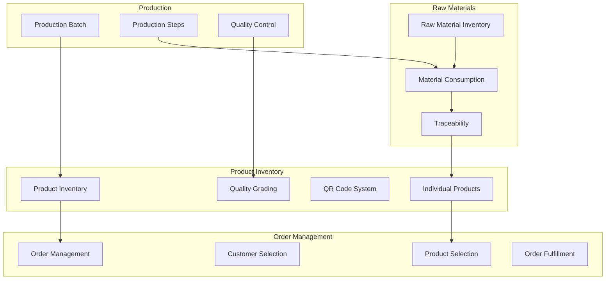
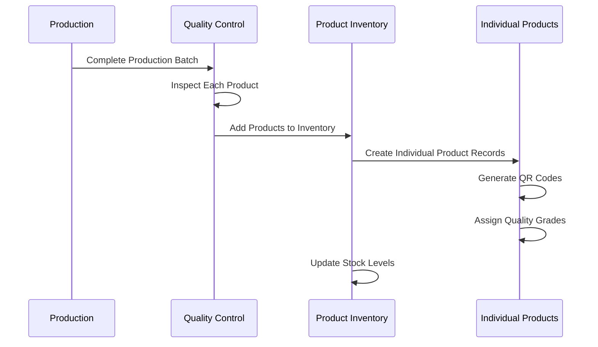
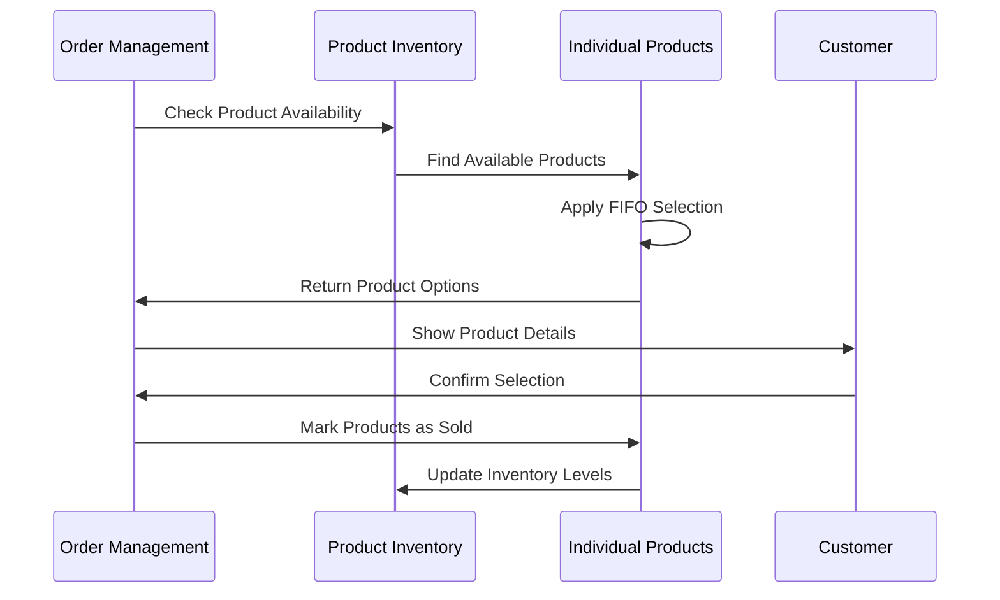
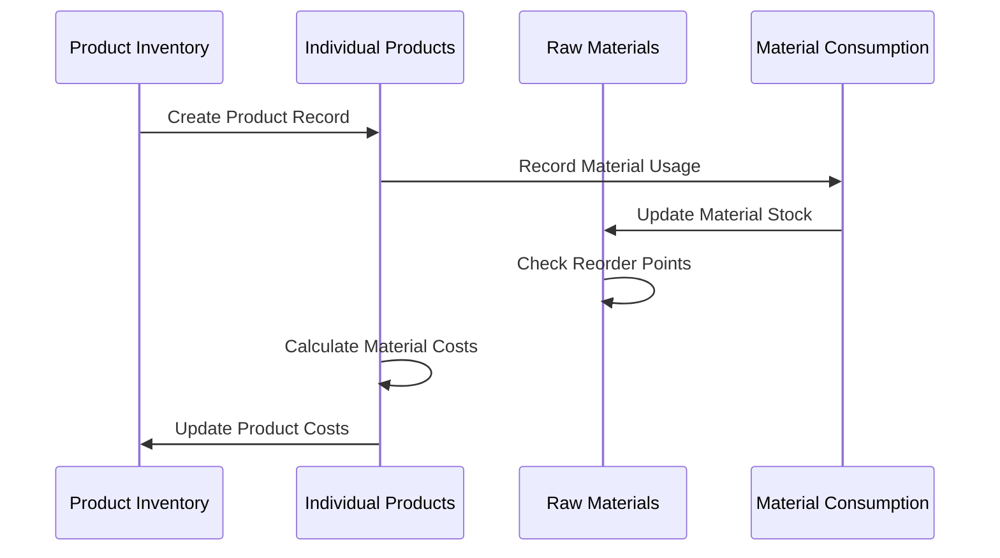

# Product Inventory Management System

## Overview

The Product Inventory Management System is a comprehensive solution for tracking finished goods, managing individual product instances, and ensuring seamless integration with the entire Rajdhani Carpet ERP workflow. This system handles everything from production completion to order fulfillment with detailed traceability.

## System Architecture



## Core Features

### 1. Individual Product Tracking
- **Unique Product IDs**: Each finished product gets a unique identifier
- **QR Code Generation**: Automatic QR code generation for easy scanning
- **Detailed Specifications**: Complete product specifications and measurements
- **Quality Grades**: Individual quality assessment (A+, A, B, C, Rejected)
- **Status Management**: Available, Sold, Damaged, In Production

### 2. Production Integration
- **Batch Tracking**: Link products to production batches
- **Step-by-step History**: Track which production steps each product went through
- **Material Consumption**: Record exact materials used for each product
- **Quality Inspection**: Individual product quality assessment
- **Production Timeline**: Complete production history for each product

### 3. Order Management Integration
- **Inventory Availability**: Real-time stock checking for orders
- **Quality-based Selection**: Select products based on quality requirements
- **FIFO Management**: Automatic selection of oldest stock first
- **Manual Selection**: Admin can manually select specific products
- **Order Fulfillment**: Track which products fulfill which orders

### 4. Raw Material Traceability
- **Material Consumption**: Track exact materials used in each product
- **Quantity Details**: Precise quantities of each material consumed
- **Cost Calculation**: Calculate material costs for each product
- **Supplier Information**: Link materials to suppliers for quality tracking

## Data Structures

### Product Interface
```typescript
interface Product {
  id: string;
  qrCode: string;
  name: string;
  category: string;
  color: string;
  size: string;
  pattern: string;
  quantity: number;
  unit: string;
  manufacturingDate: string;
  expiryDate?: string;
  materialsUsed: ProductMaterial[];
  totalCost: number;
  sellingPrice: number;
  status: "in-stock" | "low-stock" | "out-of-stock" | "expired";
  location: string;
  notes: string;
  imageUrl?: string;
  dimensions: string;
  weight: string;
  thickness: string;
  pileHeight: string;
  materialComposition: string;
  individualProducts?: IndividualProduct[];
  batchNumber?: string;
  productionHistory?: {
    batchId: string;
    productionDate: string;
    inspector: string;
    qualityGrade: string;
  };
}
```

### Individual Product Interface
```typescript
interface IndividualProduct {
  id: string;
  qrCode: string;
  productId: string;
  manufacturingDate: string;
  materialsUsed: ProductMaterial[];
  finalDimensions: string;
  finalWeight: string;
  finalThickness: string;
  finalPileHeight: string;
  qualityGrade: string;
  inspector: string;
  notes: string;
  status: "available" | "sold" | "damaged";
  batchNumber?: string;
  productionStep?: string;
  soldDate?: string;
  customerId?: string;
  orderId?: string;
}
```

### Product Material Interface
```typescript
interface ProductMaterial {
  materialId: string;
  materialName: string;
  quantity: number;
  unit: string;
  costPerUnit: number;
  totalCost: number;
  supplier: string;
  batchNumber: string;
}
```

## Workflow Integration

### 1. Production to Inventory Flow



**Process:**
1. **Production Completion**: When a production batch is completed
2. **Quality Inspection**: Each product undergoes individual quality assessment
3. **Inventory Addition**: Products are added to the main inventory
4. **Individual Records**: Separate records created for each product instance
5. **QR Generation**: Unique QR codes generated for each product
6. **Status Assignment**: Products marked as "available" for sale

### 2. Order Fulfillment Flow



**Process:**
1. **Order Creation**: Admin creates order with customer and product requirements
2. **Availability Check**: System checks current inventory levels
3. **Product Selection**: 
   - **Automatic**: FIFO selection of oldest stock first
   - **Manual**: Admin can select specific products by ID/QR
4. **Quality Matching**: Match products to customer quality requirements
5. **Order Confirmation**: Customer reviews selected products
6. **Inventory Update**: Mark selected products as "sold"
7. **Order Fulfillment**: Complete order processing

### 3. Raw Material Integration



**Process:**
1. **Material Tracking**: Each product records exact materials used
2. **Quantity Recording**: Precise quantities of each material consumed
3. **Cost Calculation**: Calculate total material cost for each product
4. **Stock Updates**: Automatically update raw material inventory
5. **Reorder Alerts**: Trigger reorder alerts when materials are low
6. **Traceability**: Complete traceability from raw materials to finished products

## Key Features Implementation

### 1. QR Code System
- **Automatic Generation**: QR codes generated when products are created
- **Unique Identifiers**: Each QR code contains product-specific information
- **Easy Scanning**: Quick product identification and tracking
- **Mobile Integration**: QR codes can be scanned with mobile devices

### 2. Quality Management
- **Individual Assessment**: Each product gets individual quality grade
- **Inspection Records**: Complete inspection history for each product
- **Quality-based Pricing**: Different pricing based on quality grades
- **Customer Preferences**: Match products to customer quality requirements

### 3. Inventory Management
- **Real-time Updates**: Instant inventory level updates
- **Stock Alerts**: Automatic alerts for low stock situations
- **Location Tracking**: Track physical location of products
- **Status Management**: Track product status (available, sold, damaged)

### 4. Cost Management
- **Material Cost Tracking**: Track exact material costs for each product
- **Production Cost Calculation**: Include production overhead costs
- **Profit Margin Analysis**: Calculate profit margins for each product
- **Pricing Strategy**: Support for different pricing strategies

## Integration Points

### 1. Order Management Integration
- **Product Selection**: Real-time product availability checking
- **Quality Matching**: Match products to order quality requirements
- **FIFO Management**: Automatic selection of oldest stock first
- **Manual Override**: Admin can manually select specific products
- **Order History**: Complete order history for each product

### 2. Production Integration
- **Batch Linking**: Link products to production batches
- **Step Tracking**: Track which production steps each product completed
- **Quality Control**: Individual product quality assessment
- **Material Consumption**: Record materials used for each product
- **Production Timeline**: Complete production history

### 3. Raw Material Integration
- **Material Consumption**: Track exact materials used in each product
- **Stock Updates**: Automatic raw material inventory updates
- **Cost Calculation**: Calculate material costs for each product
- **Supplier Tracking**: Link materials to suppliers for quality tracking
- **Reorder Management**: Trigger reorders when materials are consumed

### 4. Customer Management Integration
- **Product History**: Track which products were sold to which customers
- **Quality Preferences**: Store customer quality preferences
- **Order History**: Complete order history for each customer
- **Customer Satisfaction**: Track customer satisfaction with products

## User Interface Features

### 1. Product Display
- **Grid View**: Visual card-based product display
- **List View**: Detailed table view with all product information
- **Search & Filter**: Advanced search and filtering capabilities
- **Sort Options**: Multiple sorting options (date, price, quality, etc.)

### 2. Individual Product Management
- **Product Details**: Complete product information display
- **QR Code Display**: Show QR codes for easy scanning
- **Quality Information**: Display quality grades and inspection details
- **Material Information**: Show materials used in each product
- **Status Management**: Easy status updates (available, sold, damaged)

### 3. Inventory Analytics
- **Stock Levels**: Real-time stock level monitoring
- **Sales Analytics**: Product sales performance analysis
- **Quality Analytics**: Quality distribution analysis
- **Cost Analytics**: Cost and profit margin analysis
- **Trend Analysis**: Historical trend analysis

### 4. Order Integration
- **Product Selection**: Easy product selection for orders
- **Quality Filtering**: Filter products by quality requirements
- **Availability Checking**: Real-time availability checking
- **Order History**: Complete order history for each product

## Benefits

### 1. Complete Traceability
- **End-to-End Tracking**: Track products from raw materials to customer
- **Quality Assurance**: Complete quality history for each product
- **Compliance**: Meet regulatory and quality compliance requirements
- **Customer Confidence**: Provide detailed product information to customers

### 2. Efficient Inventory Management
- **Real-time Updates**: Instant inventory level updates
- **Automated Alerts**: Automatic alerts for low stock situations
- **Optimized Stocking**: Optimize stock levels based on demand
- **Reduced Waste**: Minimize waste through better tracking

### 3. Improved Customer Service
- **Quality Matching**: Match products to customer requirements
- **Detailed Information**: Provide detailed product information
- **Quick Response**: Quick response to customer inquiries
- **Customer Satisfaction**: Improve customer satisfaction through better service

### 4. Better Decision Making
- **Analytics**: Comprehensive analytics for better decision making
- **Cost Analysis**: Detailed cost analysis for pricing decisions
- **Quality Analysis**: Quality analysis for process improvement
- **Trend Analysis**: Historical trend analysis for planning

## Future Enhancements

### 1. Advanced Analytics
- **Predictive Analytics**: Predict demand and optimize inventory
- **Machine Learning**: ML-based quality prediction
- **AI Integration**: AI-powered product recommendations
- **Advanced Reporting**: Advanced reporting and visualization

### 2. Mobile Integration
- **Mobile App**: Mobile app for inventory management
- **QR Scanning**: Mobile QR code scanning capabilities
- **Offline Support**: Offline inventory management
- **Push Notifications**: Real-time notifications for inventory alerts

### 3. IoT Integration
- **Smart Sensors**: IoT sensors for automatic inventory tracking
- **Automated Counting**: Automated inventory counting
- **Environmental Monitoring**: Monitor storage conditions
- **Predictive Maintenance**: Predict equipment maintenance needs

### 4. Blockchain Integration
- **Immutable Records**: Blockchain-based immutable product records
- **Supply Chain Transparency**: Transparent supply chain tracking
- **Smart Contracts**: Automated contract execution
- **Quality Certification**: Blockchain-based quality certification

This comprehensive Product Inventory Management System ensures seamless integration with all aspects of the Rajdhani Carpet ERP system, providing complete traceability, efficient inventory management, and excellent customer service.
