# 🏭 Raw Material Inventory Management System - Complete Guide

## 📋 Table of Contents
1. [Overview](#overview)
2. [Material Flow Diagram](#material-flow-diagram)
3. [Inventory Management Process](#inventory-management-process)
4. [Material Consumption Tracking](#material-consumption-tracking)
5. [Production Integration](#production-integration)
6. [Product Inventory Integration](#product-inventory-integration)
7. [Stock Management](#stock-management)
8. [Quality Control](#quality-control)
9. [Reporting & Analytics](#reporting--analytics)
10. [Best Practices](#best-practices)

---

## 🎯 Overview

The Raw Material Inventory Management System is the foundation of the Rajdhani Carpet ERP, ensuring accurate tracking of all raw materials from procurement to consumption. This system maintains complete traceability of materials used in each product, enabling quality control, cost analysis, and efficient inventory management.

### Key Features:
- **📦 Real-time Inventory Tracking**: Live stock levels with automatic updates
- **🏭 Production Integration**: Automatic material consumption during production
- **📊 Complete Traceability**: Track materials from purchase to final product
- **⚠️ Stock Alerts**: Low stock and reorder point notifications
- **💰 Cost Management**: Material cost tracking and analysis
- **🔍 Quality Control**: Material quality grades and supplier performance

---

## 🔄 Material Flow Diagram

```mermaid
graph TD
    A[📦 Material Purchase] --> B[📥 Receive & Inspect]
    B --> C[📊 Update Inventory]
    C --> D[🏷️ Quality Assessment]
    D --> E[📦 Store in Warehouse]
    
    E --> F[🏭 Production Request]
    F --> G[📋 Material Allocation]
    G --> H[⚙️ Production Process]
    H --> I[📉 Consume Materials]
    I --> J[📊 Update Stock Levels]
    
    J --> K[📦 Product Creation]
    K --> L[🏷️ Material Traceability]
    L --> M[📋 Bill of Materials]
    M --> N[🔍 Quality Inspection]
    N --> O[✅ Final Product]
    
    J --> P{⚠️ Low Stock?}
    P -->|✅ Yes| Q[🛒 Reorder Alert]
    P -->|❌ No| R[📊 Continue Monitoring]
    
    style A fill:#e1f5fe
    style I fill:#ffebee
    style L fill:#e8f5e8
    style Q fill:#fff3e0
```



---

## 📦 Inventory Management Process

### **Phase 1: Material Procurement & Receiving**

#### **Step 1: Material Purchase**
```typescript
interface MaterialPurchase {
  purchaseId: string;
  supplierId: string;
  supplierName: string;
  materialId: string;
  materialName: string;
  quantity: number;
  unit: string;
  costPerUnit: number;
  totalCost: number;
  purchaseDate: string;
  expectedDelivery: string;
  status: "ordered" | "in-transit" | "received" | "inspected";
}
```

**Process:**
1. **Purchase Order Creation**
   - Select supplier and materials
   - Specify quantities and costs
   - Set delivery timeline
   - Generate purchase order

2. **Supplier Management**
   - Supplier performance tracking
   - Quality history
   - Delivery reliability
   - Cost competitiveness

#### **Step 2: Material Receiving & Inspection**
```typescript
interface MaterialReceiving {
  receivingId: string;
  purchaseId: string;
  materialId: string;
  receivedQuantity: number;
  acceptedQuantity: number;
  rejectedQuantity: number;
  qualityGrade: "A+" | "A" | "B" | "C" | "rejected";
  inspector: string;
  inspectionDate: string;
  notes: string;
}
```

**Quality Inspection Process:**
1. **Visual Inspection**
   - Check for damage
   - Verify specifications
   - Assess quality grade

2. **Quantity Verification**
   - Count received items
   - Compare with order
   - Record discrepancies

3. **Quality Assessment**
   - Grade materials (A+, A, B, C)
   - Reject substandard items
   - Document issues

---

## 🏭 Material Consumption Tracking

### **Phase 2: Production Material Allocation**

#### **Step 3: Material Requirement Calculation**
```typescript
interface MaterialRequirement {
  productId: string;
  productName: string;
  batchSize: number;
  materials: {
    materialId: string;
    materialName: string;
    requiredQuantity: number;
    unit: string;
    costPerUnit: number;
    totalCost: number;
  }[];
  totalMaterialCost: number;
}
```

**Calculation Process:**
1. **Bill of Materials (BOM)**
   - Standard material requirements per product
   - Quantity calculations based on batch size
   - Cost calculations

2. **Material Availability Check**
   - Check current stock levels
   - Identify shortages
   - Calculate required purchases

#### **Step 4: Material Allocation & Consumption**
```typescript
interface MaterialConsumption {
  productionBatchId: string;
  stepId: number;
  stepName: string;
  materials: {
    materialId: string;
    materialName: string;
    allocatedQuantity: number;
    consumedQuantity: number;
    wasteQuantity: number;
    unit: string;
    costPerUnit: number;
    totalCost: number;
    batchNumber: string;
    qualityGrade: string;
  }[];
  consumptionDate: string;
  operator: string;
  notes: string;
}
```

**Consumption Process:**
1. **Material Allocation**
   - Select materials from inventory
   - Apply FIFO principle
   - Record batch numbers
   - Track quality grades

2. **Production Consumption**
   - Real-time consumption tracking
   - Waste recording
   - Cost allocation
   - Quality monitoring

3. **Inventory Updates**
   - Automatic stock reduction
   - Real-time level updates
   - Low stock alerts
   - Reorder triggers

---

## 🏭 Production Integration

### **Phase 3: Production Step Integration**

#### **Step 5: Step-by-Step Material Tracking**
```typescript
interface ProductionStepMaterial {
  stepId: number;
  stepName: string;
  productId: string;
  batchId: string;
  materials: {
    materialId: string;
    materialName: string;
    inputQuantity: number;
    outputQuantity: number;
    wasteQuantity: number;
    efficiency: number;
    cost: number;
    qualityGrade: string;
  }[];
  startDate: string;
  completionDate: string;
  operator: string;
  notes: string;
}
```

**Step Integration:**
1. **Step 1: Punching (Weaving Base Layer)**
   - Cotton Yarn consumption
   - Backing cloth usage
   - Waste calculation
   - Quality assessment

2. **Step 2: Dyeing (Coloring Process)**
   - Dye consumption
   - Chemical usage
   - Water consumption
   - Waste management

3. **Step 3: Cutting & Finishing**
   - Latex solution usage
   - Cutting waste
   - Finishing materials
   - Quality control

#### **Step 6: Material Waste Management**
```typescript
interface MaterialWaste {
  wasteId: string;
  productionBatchId: string;
  stepId: number;
  materialId: string;
  materialName: string;
  wasteQuantity: number;
  wasteType: "cutting" | "dyeing" | "processing" | "quality";
  wasteReason: string;
  disposalMethod: "recycle" | "reuse" | "dispose";
  cost: number;
  date: string;
}
```

**Waste Management:**
1. **Waste Classification**
   - Cutting waste
   - Processing waste
   - Quality rejections
   - Chemical waste

2. **Waste Handling**
   - Recycling opportunities
   - Reuse possibilities
   - Proper disposal
   - Cost tracking

---

## 📦 Product Inventory Integration

### **Phase 4: Product Material Traceability**

#### **Step 7: Individual Product Material Tracking**
```typescript
interface IndividualProductMaterials {
  productId: string;
  individualProductId: string;
  qrCode: string;
  materials: {
    materialId: string;
    materialName: string;
    quantity: number;
    unit: string;
    cost: number;
    batchNumber: string;
    qualityGrade: string;
    supplier: string;
    manufacturingDate: string;
  }[];
  totalMaterialCost: number;
  manufacturingDate: string;
  inspector: string;
}
```

**Traceability Features:**
1. **Complete Material History**
   - All materials used in each product
   - Batch numbers and quality grades
   - Supplier information
   - Cost breakdown

2. **QR Code Integration**
   - Unique QR codes for each product
   - Material information embedded
   - Quick access to complete history
   - Quality verification

#### **Step 8: Bill of Materials (BOM)**
```typescript
interface BillOfMaterials {
  productId: string;
  productName: string;
  version: string;
  materials: {
    materialId: string;
    materialName: string;
    standardQuantity: number;
    unit: string;
    costPerUnit: number;
    totalCost: number;
    qualityRequirement: string;
    supplier: string;
  }[];
  totalCost: number;
  lastUpdated: string;
  approvedBy: string;
}
```

**BOM Management:**
1. **Standard BOM Creation**
   - Define standard material requirements
   - Set quality specifications
   - Establish cost standards
   - Version control

2. **BOM Updates**
   - Material substitutions
   - Quantity adjustments
   - Cost updates
   - Quality improvements

---

## 📊 Stock Management

### **Phase 5: Inventory Control**

#### **Step 9: Real-time Stock Monitoring**
```typescript
interface StockLevel {
  materialId: string;
  materialName: string;
  currentStock: number;
  unit: string;
  minStockLevel: number;
  maxStockLevel: number;
  reorderPoint: number;
  status: "in-stock" | "low-stock" | "out-of-stock" | "overstock";
  lastUpdated: string;
  cost: number;
  totalValue: number;
}
```

**Stock Monitoring:**
1. **Stock Level Tracking**
   - Real-time inventory levels
   - Automatic status updates
   - Cost calculations
   - Value tracking

2. **Reorder Management**
   - Automatic reorder triggers
   - Reorder point calculations
   - Purchase recommendations
   - Supplier selection

#### **Step 10: Stock Alerts & Notifications**
```typescript
interface StockAlert {
  alertId: string;
  materialId: string;
  materialName: string;
  alertType: "low-stock" | "out-of-stock" | "overstock" | "expiry";
  currentLevel: number;
  threshold: number;
  severity: "low" | "medium" | "high" | "critical";
  message: string;
  date: string;
  status: "active" | "acknowledged" | "resolved";
}
```

**Alert System:**
1. **Low Stock Alerts**
   - Below reorder point
   - Critical stock levels
   - Expiry warnings
   - Quality alerts

2. **Notification Management**
   - Email notifications
   - Dashboard alerts
   - Mobile notifications
   - Escalation procedures

---

## 🔍 Quality Control

### **Phase 6: Material Quality Management**

#### **Step 11: Quality Grade System**
```typescript
interface MaterialQuality {
  materialId: string;
  materialName: string;
  qualityGrade: "A+" | "A" | "B" | "C" | "rejected";
  gradeDescription: string;
  priceMultiplier: number;
  usageRestrictions: string[];
  inspectionCriteria: string[];
  supplierPerformance: number;
}
```

**Quality Grades:**
- **A+ (Premium)**: Highest quality, premium pricing
- **A (Standard)**: High quality, standard pricing
- **B (Economy)**: Acceptable quality, reduced pricing
- **C (Basic)**: Basic quality, discounted pricing
- **Rejected**: Unacceptable, return to supplier

#### **Step 12: Supplier Performance Tracking**
```typescript
interface SupplierPerformance {
  supplierId: string;
  supplierName: string;
  materials: {
    materialId: string;
    materialName: string;
    totalOrders: number;
    totalQuantity: number;
    acceptedQuantity: number;
    rejectedQuantity: number;
    qualityScore: number;
    deliveryScore: number;
    costScore: number;
    overallScore: number;
  }[];
  averageQualityScore: number;
  averageDeliveryScore: number;
  averageCostScore: number;
  overallPerformance: number;
}
```

**Performance Metrics:**
1. **Quality Metrics**
   - Acceptance rate
   - Rejection rate
   - Quality consistency
   - Improvement trends

2. **Delivery Metrics**
   - On-time delivery
   - Delivery accuracy
   - Communication quality
   - Problem resolution

---

## 📈 Reporting & Analytics

### **Phase 7: Material Analytics**

#### **Step 13: Consumption Analytics**
```typescript
interface ConsumptionAnalytics {
  period: string;
  materials: {
    materialId: string;
    materialName: string;
    totalConsumed: number;
    totalCost: number;
    averageConsumption: number;
    peakConsumption: number;
    efficiency: number;
    wastePercentage: number;
  }[];
  totalConsumption: number;
  totalCost: number;
  averageEfficiency: number;
  totalWaste: number;
}
```

**Analytics Features:**
1. **Consumption Trends**
   - Daily/weekly/monthly consumption
   - Seasonal patterns
   - Production correlation
   - Cost analysis

2. **Efficiency Analysis**
   - Material utilization
   - Waste reduction
   - Cost optimization
   - Quality improvement

#### **Step 14: Cost Analysis**
```typescript
interface CostAnalysis {
  period: string;
  products: {
    productId: string;
    productName: string;
    materialCost: number;
    laborCost: number;
    overheadCost: number;
    totalCost: number;
    sellingPrice: number;
    profitMargin: number;
  }[];
  totalMaterialCost: number;
  totalProductionCost: number;
  averageProfitMargin: number;
  costTrends: CostTrend[];
}
```

**Cost Management:**
1. **Cost Tracking**
   - Material cost per product
   - Labor cost allocation
   - Overhead distribution
   - Profit margin analysis

2. **Cost Optimization**
   - Material substitution
   - Supplier negotiation
   - Process improvement
   - Waste reduction

---

## 🔄 Integration Points

### **Production System Integration**
- Real-time material consumption
- Automatic stock updates
- Production step tracking
- Quality control integration

### **Product Inventory Integration**
- Complete material traceability
- Individual product material history
- QR code material information
- Quality grade tracking

### **Supplier Management Integration**
- Supplier performance tracking
- Purchase order management
- Quality assessment
- Cost analysis

### **Financial System Integration**
- Material cost tracking
- Inventory valuation
- Cost allocation
- Profit analysis

---

## 📊 Admin Interface Features

### **Material Management**
- Material catalog management
- Stock level monitoring
- Quality grade assignment
- Supplier performance tracking

### **Inventory Control**
- Real-time stock updates
- Automatic reorder triggers
- Stock alerts and notifications
- Inventory valuation

### **Production Integration**
- Material requirement calculation
- Consumption tracking
- Waste management
- Quality control

### **Reporting & Analytics**
- Consumption reports
- Cost analysis
- Supplier performance
- Quality trends

---

## 🚀 Best Practices

### **Material Management**
- ✅ Maintain accurate stock levels
- ✅ Use FIFO for material rotation
- ✅ Regular quality inspections
- ✅ Track supplier performance
- ❌ Don't ignore low stock alerts
- ❌ Don't skip quality inspections

### **Production Integration**
- ✅ Real-time consumption tracking
- ✅ Accurate waste recording
- ✅ Quality grade tracking
- ✅ Cost allocation
- ❌ Don't estimate consumption
- ❌ Don't ignore waste

### **Inventory Control**
- ✅ Set appropriate reorder points
- ✅ Monitor stock levels regularly
- ✅ Track material costs
- ✅ Maintain quality standards
- ❌ Don't overstock materials
- ❌ Don't ignore expiry dates

### **Quality Control**
- ✅ Inspect all received materials
- ✅ Grade materials consistently
- ✅ Track quality trends
- ✅ Monitor supplier performance
- ❌ Don't accept substandard materials
- ❌ Don't skip quality assessments

---

## 🔧 System Configuration

### **Material Categories**
```typescript
const materialCategories = {
  "Yarn": {
    description: "Various types of yarn for carpet manufacturing",
    units: ["rolls", "kg", "meters"],
    qualityGrades: ["A+", "A", "B", "C"],
    storageConditions: "Dry, cool place"
  },
  "Dye": {
    description: "Dyes and colorants for carpet coloring",
    units: ["liters", "kg", "gallons"],
    qualityGrades: ["A+", "A", "B", "C"],
    storageConditions: "Sealed containers, away from heat"
  },
  "Chemical": {
    description: "Chemicals for processing and finishing",
    units: ["liters", "kg", "pounds"],
    qualityGrades: ["A+", "A", "B", "C"],
    storageConditions: "Ventilated area, safety protocols"
  },
  "Fabric": {
    description: "Backing cloth and fabric materials",
    units: ["sqm", "sqft", "meters"],
    qualityGrades: ["A+", "A", "B", "C"],
    storageConditions: "Dry, clean environment"
  }
};
```

### **Quality Grade Definitions**
```typescript
const qualityGrades = {
  "A+": {
    description: "Premium quality, highest standards",
    priceMultiplier: 1.3,
    usageRestrictions: [],
    inspectionCriteria: ["Perfect condition", "Exact specifications", "Premium supplier"]
  },
  "A": {
    description: "High quality, standard premium",
    priceMultiplier: 1.0,
    usageRestrictions: [],
    inspectionCriteria: ["Good condition", "Meets specifications", "Reliable supplier"]
  },
  "B": {
    description: "Standard quality, acceptable",
    priceMultiplier: 0.8,
    usageRestrictions: ["Not for premium products"],
    inspectionCriteria: ["Acceptable condition", "Minor variations", "Standard supplier"]
  },
  "C": {
    description: "Basic quality, discounted",
    priceMultiplier: 0.6,
    usageRestrictions: ["Limited usage", "Not for premium products"],
    inspectionCriteria: ["Basic condition", "Some variations", "Economy supplier"]
  }
};
```

---

*This comprehensive raw material inventory management system ensures accurate tracking, quality control, and cost management throughout the production process.*
